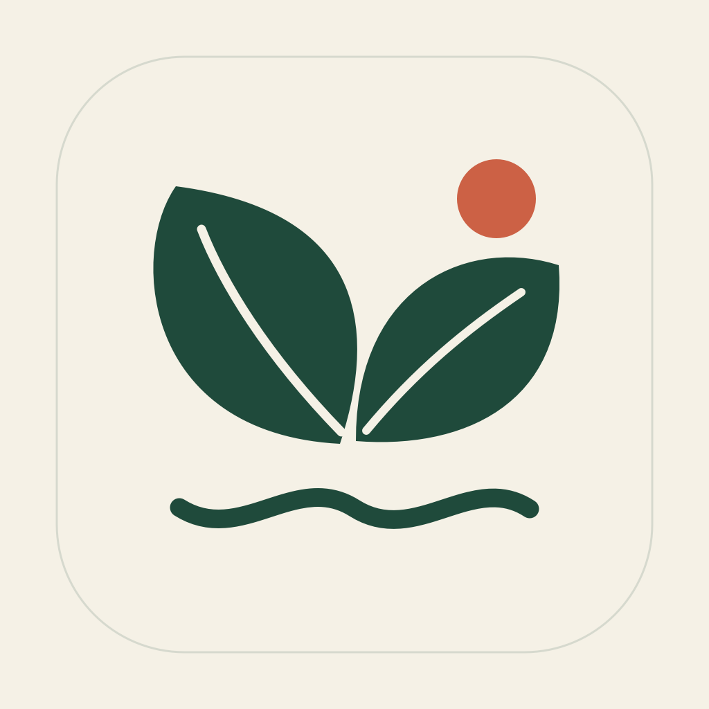
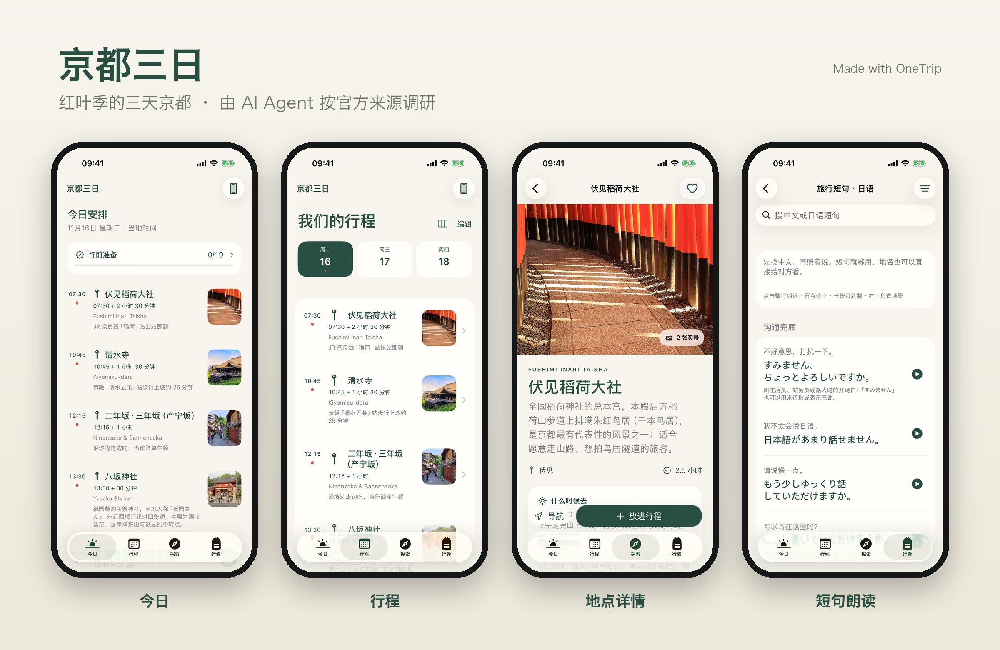
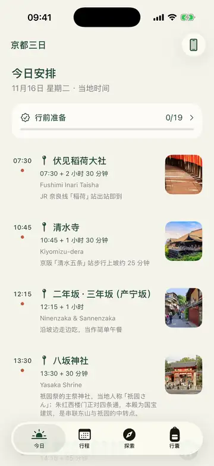
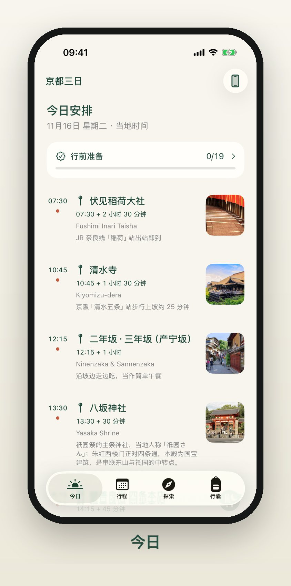
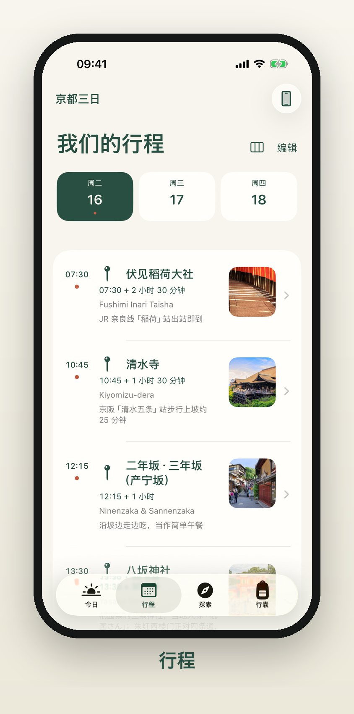
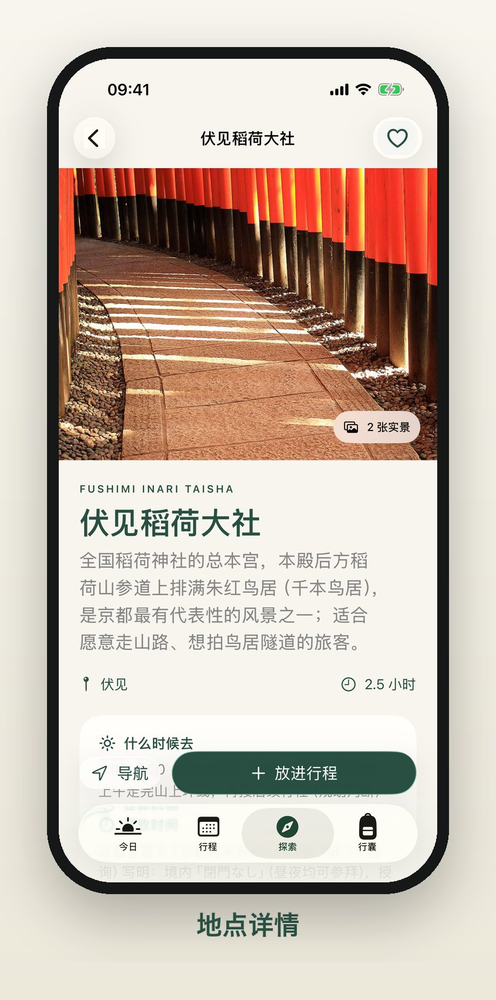
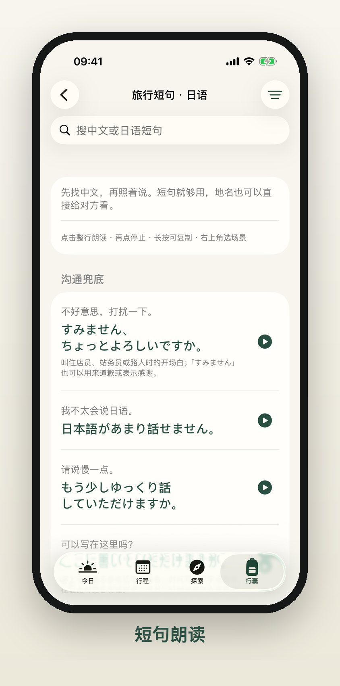
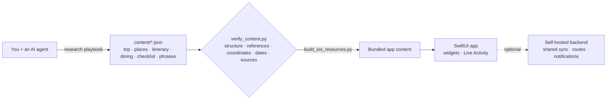

<div align="center">



# OneTrip

**One trip, one app.**

Tell an AI agent where you're going. It researches by strict evidence rules and fills in the content;<br>you get a native, offline iPhone app for that trip, with widgets.

[](https://github.com/chenzd01/onetrip/actions/workflows/ci.yml)
[](LICENSE)


[](AGENTS.md)
[](.agents/skills/new-trip/SKILL.md)

[中文](README.md) · English

<picture>
  <source media="(prefers-color-scheme: dark)" srcset="docs/assets/hero-dark.jpg">
  
</picture>

</div>

> The app UI is currently in Simplified Chinese; an English UI is the top roadmap item. All documentation is available in English.

## Your trip app in three steps

1. **Create a repo**: click **Use this template** and create your own **private** repository (your itinerary and stays will live there).
2. **Tell the agent where you're going**: in Claude Code or Codex, type `/new-trip Lisbon 2027-05-01..05 2 people`. It follows the [research playbook](docs/en/research-playbook.md), reads official sources, fills `content/`, validates and builds, and checks back with you at key points.
3. **Put it on your phone**: try it free in the simulator; with an Apple Developer account, install it on your companions' iPhones through TestFlight.

<p align="center"></p>

## The Kyoto example, researched by an agent

The bundled **3-day Kyoto** example was produced entirely by AI agents following this repository's playbook:

| 12 places | 6 restaurants | 19 prep items | 30 Japanese phrases | 28 openly licensed photos | 150 sources |
| :-: | :-: | :-: | :-: | :-: | :-: |

Every fact has a source URL and a check date, and gaps are left rather than guessed. Several sub-agents researched in parallel before the results were merged and validated, in about an hour. Research records, conflicts and open questions are in [docs/research/kyoto/](docs/research/kyoto/), so you can check any claim.

> The example is for demonstration and was checked on 2026-09-24. If you actually go to Kyoto, re-check the official sources before you travel.

## Why it's worth a look

- **Native and offline**: SwiftUI, with all content and coordinates bundled, so the itinerary and ticket files work without a signal.
- **One app per trip**: the app code contains no city, date or currency; everything comes from `content/trip.json`. A new destination is just new content, and the tests still pass.
- **Agent-ready**: [`AGENTS.md`](AGENTS.md) sets the rules, the `/new-trip` skill runs the workflow, and the [phase prompts](docs/en/agent-prompts.md) work with any agent.
- **No invention**: official price, planning budget and estimate are kept apart, and uncertain information is clearly flagged in the UI.
- **Serious engineering**: Swift 6 strict concurrency, 141 unit tests, CI and a privacy scanner. It started as a real trip's app and was used every day on the road.

## Features

| | |
| :-: | --- |
|  | **Today**<br>On the trip: what's next, when, where the tickets are, tonight's stay.<br>Before it: a countdown and date-gated preparation reminders.<br>Home-screen widgets and a Live Activity show the next item. |
|  | **Itinerary**<br>Day by day: add, remove, retime, replace places, custom places, meals and reservations; clustered by area with rainy-day alternatives. |
|  | **Explore**<br>Places (photos, hours, prices, best time, rain plan, in-depth guides), dining (menus, tax basis), guides and hotel comparison. |
|  | **Travel kit**<br>Checklist, two-currency budget, flights, stays, tickets with offline originals (PDF/images), a spoken local-language phrasebook, reminders, backup import/export. |

**Optional backend** ([`server/`](server/)): two phones share one itinerary (local-first three-way merge with conflict review), ticket files sync, self-hosted routing (Valhalla + OpenStreetMap) and companion "touch" notifications. Without it, the app runs fully offline.

## Quick start

Requires macOS, Xcode 26+, [XcodeGen](https://github.com/yonaskolb/XcodeGen) (`brew install xcodegen`) and Python 3.11+.

```bash
make setup   # Pillow + signing config for the simulator
make open    # validate and build content, generate the project; run on an iPhone simulator in Xcode
make test    # content pipeline, backend, deploy and iOS tests
```

To see the "during the trip" Today screen, add the launch argument `-TripNow 2027-11-16T11:00` to the Xcode scheme (Debug builds only).

## Make one for your destination

- **Hand it to an agent**: `/new-trip <destination> <dates> <party size>` (Claude Code reads `.claude/skills/`, Codex reads `.agents/skills/`), or give the [phase prompts](docs/en/agent-prompts.md) to any agent one at a time.
- **Do it yourself**: follow the [zero-to-TestFlight checklist](docs/en/new-destination.md); every step has a done criterion.
- **Show it off**: `make screenshots` turns your content into a hero image, single screens, a social preview and an animation.

## How it works



| Doc | What it covers |
| --- | --- |
| [new-destination.md](docs/en/new-destination.md) | Complete checklist from zero to TestFlight |
| [agent-prompts.md](docs/en/agent-prompts.md) | Copy-paste prompts for each phase |
| [research-playbook.md](docs/en/research-playbook.md) | How to research each content type, checks and pitfalls |
| [content-schema.md](docs/en/content-schema.md) | Every field in `content/` |
| [architecture.md](docs/en/architecture.md) | App, sync and backend architecture |
| [backend.md](docs/en/backend.md) | Self-hosting the optional backend |
| [ios-delivery.md](docs/en/ios-delivery.md) | Signing, archiving, TestFlight |
| [lessons-learned.md](docs/en/lessons-learned.md) | Pitfalls we hit in practice |
| [privacy-before-publish.md](docs/en/privacy-before-publish.md) | Privacy and copyright checks before going public |

## Showcase

Made an app for your trip with OneTrip? Submit it with [Show your trip](https://github.com/chenzd01/onetrip/issues/new?template=showcase.yml); picks are featured here.

## Roadmap

- [ ] English UI (help wanted, see [CONTRIBUTING](CONTRIBUTING.md))
- [ ] One-tap shareable itinerary poster
- [ ] More destination example packs

## Privacy and copyright

Your trip repository will contain companions, stays and dates, so **keep it private**; share the app via TestFlight, not the repo. Signing, backend URL and keys live in git-ignored xcconfig files. Run `make privacy` before publishing anything. Do not put social-media images/text or booking-platform photos in a public repo without permission.

## Contributing and license

Issues and pull requests are welcome; see [CONTRIBUTING.md](CONTRIBUTING.md).

Code: [MIT](LICENSE). Kyoto example text and data: [CC0 1.0](content/LICENSE). Photos come from Wikimedia Commons and keep their own licenses; creators and licenses are listed in [content/photo-sources.json](content/photo-sources.json) and in the app's About screen. The same attribution applies to photos visible in the README screenshots.

If OneTrip helps you, a ⭐ helps others find it.
