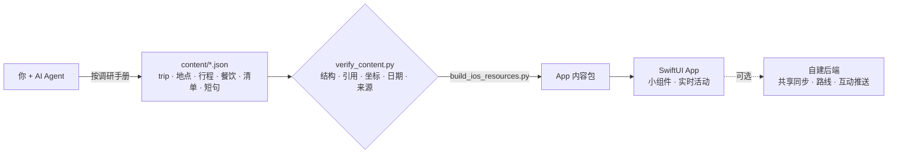

<div align="center">


# OneTrip · 一程

**每次旅行，都值得一个专属 App。**

告诉 AI Agent 你要去哪，它按证据规则调研、填内容，<br>你得到一个原生、离线、带桌面小组件的 iPhone 旅行 App。

[](https://github.com/chenzd01/onetrip/actions/workflows/ci.yml)
[](LICENSE)


[](AGENTS.md)
[](.agents/skills/new-trip/SKILL.md)

中文 · [English](README.en.md)

<picture>
  <source media="(prefers-color-scheme: dark)" srcset="docs/assets/hero-dark.jpg">
  
</picture>

</div>

## 三步做出你的旅行 App

1. **建仓库**：点右上角 **Use this template**，建一个你自己的**私有**仓库（行程、住处都会放进去）。
2. **告诉 Agent 去哪**：在 Claude Code 或 Codex 里输入 `/new-trip 里斯本 2027-05-01..05 2人`。它按[调研手册](docs/zh/research-playbook.md)查官方来源、填写 `content/`、校验、构建，关键节点会停下来和你确认。
3. **装到手机上**：模拟器里免费试用；有 Apple 开发者账号就用 TestFlight 装到同行人的 iPhone。

<p align="center"></p>

## 京都示例：由 Agent 调研完成

仓库自带的**京都 3 日**示例，全部由 AI Agent 按本仓库的调研手册完成：

| 12 个地点 | 6 家餐厅 | 19 条行前准备 | 30 句日语短句 | 28 张开放许可照片 | 150 个来源 |
| :-: | :-: | :-: | :-: | :-: | :-: |

每条事实都带来源链接和核对日期，查不到就留空；多个子 Agent 并行调研、再整合校验，用时约 1 小时。调研记录、冲突和未决事项都在 [docs/research/kyoto/](docs/research/kyoto/) 里，可以逐条核对。

> 示例用于演示，信息核对于 2026-09-24。真要去京都，出发前请以官方最新信息为准。

## 为什么值得一试

- **原生，而且离线**：SwiftUI 写成，所有内容和坐标都打包进 App，地铁里没网也能看行程和门票原件。
- **一次旅行一个 App**：App 代码里没有任何城市、日期和货币，全部来自 `content/trip.json`；换目的地只换内容，测试照样全过。
- **Agent 原生**：[`AGENTS.md`](AGENTS.md) 规定 Agent 怎么干活，`/new-trip` 技能把流程串起来，[分阶段提示词](docs/zh/agent-prompts.md)可直接复制给任何 Agent。
- **不编造**：官方价、规划预算、估算分开写；不确定的信息会在界面上醒目标出。
- **认真的工程**：Swift 6 严格并发、141 个单元测试、CI、隐私扫描；诞生于一次真实旅行，旅途中每天在用。

## 功能一览

| | |
| :-: | --- |
|  | **今日**<br>旅途中：当天接下来去哪、几点、门票在哪、今晚住哪。<br>出发前：倒计时和按日期出现的行前提醒。<br>桌面小组件和实时活动显示下一项安排。 |
|  | **行程**<br>逐日安排，增删改、调整时间与时长、替换地点，添加自定义地点、用餐与预约；同区域聚类，自带雨天备选。 |
|  | **探索**<br>地点（实拍照片、开放时间、票价、建议时段、雨天备选、深度攻略）、餐饮（菜单、税费口径）、攻略、酒店比价。 |
|  | **行囊**<br>行前清单、双币预算、航班、住宿、门票原件（PDF / 图片离线保存）、当地语言短句一键朗读、提醒、备份导入导出。 |

**可选后端**（[`server/`](server/)）：两台手机共享同一份行程（本机优先 + 三方合并 + 冲突对比）、门票原件同步、自建路线（Valhalla + OpenStreetMap）、同行人互动推送。不配置时 App 以纯离线模式运行。

## 快速开始

需要 macOS、Xcode 26+、[XcodeGen](https://github.com/yonaskolb/XcodeGen)（`brew install xcodegen`）和 Python 3.11+。

```bash
make setup   # 安装 Pillow，准备模拟器用的签名配置
make open    # 校验并构建内容、生成工程；在 Xcode 里选 iPhone 模拟器运行
make test    # 内容管线、后端、部署脚本和 iOS 全部测试
```

想看「旅途中」的今日页：在 Xcode scheme 的启动参数里加 `-TripNow 2027-11-16T11:00`（仅 Debug 构建生效）。

## 为你的目的地做一个

- **交给 Agent**：`/new-trip <目的地> <日期> <人数>`（Claude Code 读 `.claude/skills/`，Codex 读 `.agents/skills/`），或把[分阶段提示词](docs/zh/agent-prompts.md)逐段交给任意 Agent。
- **自己动手**：照着[从零到 TestFlight](docs/zh/new-destination.md) 的清单做，每一步都有完成标准。
- **做完晒一晒**：`make screenshots` 用你的内容生成首图、单屏图、社交预览图和动图。

## 工作原理



| 文档 | 说明 |
| --- | --- |
| [new-destination.md](docs/zh/new-destination.md) | 从零到 TestFlight 的完整清单 |
| [agent-prompts.md](docs/zh/agent-prompts.md) | 各阶段可直接复制给 Agent 的提示词 |
| [research-playbook.md](docs/zh/research-playbook.md) | 各类内容的调研方法、核对步骤与常见坑 |
| [content-schema.md](docs/zh/content-schema.md) | `content/` 每个字段的说明 |
| [architecture.md](docs/zh/architecture.md) | App、同步与后端架构 |
| [backend.md](docs/zh/backend.md) | 可选后端的自建步骤 |
| [ios-delivery.md](docs/zh/ios-delivery.md) | 签名、归档、TestFlight |
| [lessons-learned.md](docs/zh/lessons-learned.md) | 实战中踩过的坑 |
| [privacy-before-publish.md](docs/zh/privacy-before-publish.md) | 公开前的隐私与版权自检 |

## Showcase

用 OneTrip 做了自己的旅行 App？用[「分享你的目的地」](https://github.com/chenzd01/onetrip/issues/new?template=showcase.yml)投稿，精选会展示在这里。

## 路线图

- [ ] 英文界面（最需要帮手，见 [CONTRIBUTING](CONTRIBUTING.md)）
- [ ] 一键生成可分享的行程海报
- [ ] 更多目的地示例包

## 隐私与版权

你的旅行仓库会装进同行人、住处、日期等私人信息，**请保持私有**；分享 App 用 TestFlight，不要分享仓库。签名信息、后端地址与密钥都放在被忽略的 xcconfig 里；公开任何东西前运行 `make privacy`。社交平台的图文、订房平台的图片未经授权不要放进公开仓库。

## 参与与许可

欢迎 issue 和 PR，先看 [CONTRIBUTING.md](CONTRIBUTING.md)。

代码：[MIT](LICENSE)。京都示例的文字与数据：[CC0 1.0](content/LICENSE)；照片来自 Wikimedia Commons，各自保留原许可证，作者与许可见 [content/photo-sources.json](content/photo-sources.json)，App 内「关于」页也会逐张列出。README 截图中出现的照片同样适用上述署名。

如果这个项目对你有帮助，点个 ⭐ 让更多人看到。
